<div align="center">
  
</div>

<br/>

<div align="center">
  
</div>

<br/>

---

<br/>

### `~/whoami`

<table width="100%">
<tr><td>

```yaml
nome:      João Oliveira
alias:     Nitr0_Zeus
função:    Backend / Software Developer
stack:     Kotlin, Java
status:    conectado, procurando bugs pra explorar
```

</td></tr>
</table>

<br/>

### `~/stack --list`

<div align="center">


</div>

<br/>

---

<br/>

### `~/projetos --destaque`

<table width="100%">
  <tr>
    <td width="50%" valign="top">
      <h4>💀&nbsp; site-comercial</h4>
      <p>Plataforma web comercial desenvolvida para apresentação e vendas.</p>
      <a href="https://github.com/Nitr0-Zeus/site-comercial">
        
      </a>
    </td>
    <td width="50%" valign="top">
      <h4>💀&nbsp; Grimório API</h4>
      <p>API para gerenciamento de dados temáticos — backend organizado e direto ao ponto.</p>
      <a href="https://github.com/Nitr0-Zeus/Grimorio-Api">
        
      </a>
    </td>
  </tr>
  <tr><td colspan="2"><br/></td></tr>
  <tr>
    <td width="50%" valign="top">
      <h4>💀&nbsp; Bank System (Attempt)</h4>
      <p>Simulação de sistema bancário — lógica de transações e contas.</p>
      <a href="https://github.com/Nitr0-Zeus/Bank-system-attempt">
        
      </a>
    </td>
    <td width="50%" valign="top">
      <h4>➕&nbsp; próximo projeto</h4>
      <p>Ainda escrevendo o código... volta depois.</p>
    </td>
  </tr>
</table>

<br/>

---

<br/>

### `~/stats --show`

<div align="center">


<br/><br/>


</div>

<br/>

---

<br/>

### `~/contato --canais`

<div align="center">

<a href="mailto:seuemail@exemplo.com">
  
</a>
<a href="https://www.linkedin.com/in/seu-usuario">
  
</a>
<a href="https://discord.com/users/seu-usuario">
  
</a>

</div>

<br/>

<div align="center">
  
</div>
